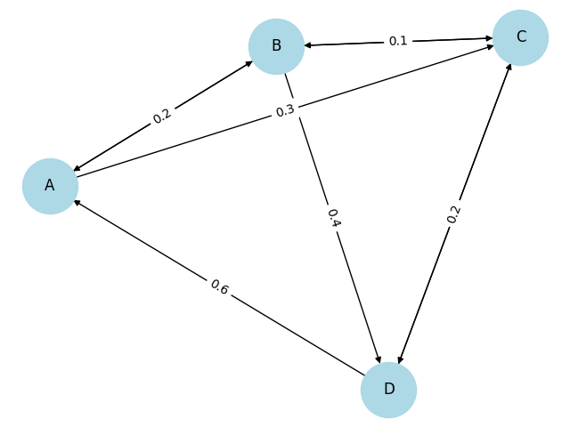
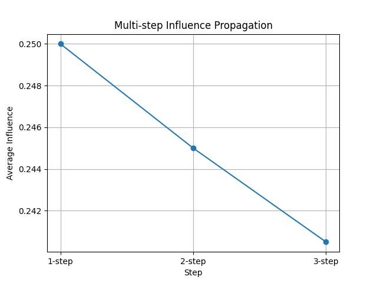

# 📊 행렬곱 기반 가중치 네트워크 영향력 전파 분석

(Matrix-based Weighted Network Influence Propagation Analysis)

---

## 📌 1. 개요 (Overview)

본 프로젝트는 가중치 네트워크에서 행렬곱(Matrix Multiplication)을 활용하여  
노드 간 영향력 전파(Influence Propagation)를 분석하는 것을 목표로 한다.

단순한 연결 관계를 넘어, **다단계 경로를 통한 영향력의 누적과 감소 현상**을  
정량적으로 분석하였다.

---

## 🧠 2. 핵심 개념

- 네트워크 구조 → 인접 행렬(Adjacency Matrix)로 표현
- 행렬곱 연산
  - A² : 2단계 영향력
  - A³ : 3단계 영향력
- 다중 경로를 통한 영향력 누적 및 감소 분석

---

## 📊 3. 데이터 구성

본 프로젝트에서는 실제 네트워크를 기반으로
노드 간 영향력을 0~1 사이의 값으로 정규화한  
**가중치 인접 행렬 (Synthetic Data)** 을 직접 생성하였다.

```
A =
[ 0   0.9 0.3 0
  0.2 0   0.5 0.4
  0   0.1 0   0.8
  0.6 0   0.2 0 ]
```

각 원소 Aᵢⱼ는 노드 i가 노드 j에 미치는 영향력의 강도를 의미한다.

---

## ⚙️ 4. 실행 방법

```
python experiment.py
```

---

## 📈 5. 결과

### 🔹 (1) 가중치 네트워크 그래프



→ 노드 간 연결 관계와 영향력(가중치)을 시각적으로 표현

---

### 🔹 (2) 다단계 영향력 전파 분석



→ 행렬곱을 통해 계산된 1단계, 2단계, 3단계 영향력 비교

---

## 🔍 6. 결과 해석

- 단계가 증가할수록 평균 영향력은 감소하는 경향을 보임
- 이는 영향력이 여러 단계를 거치며 점진적으로 약화되기 때문임
- 다중 경로가 존재할 경우 영향력이 누적되는 현상도 확인 가능

특히 본 네트워크에서는 하나의 노드가 여러 경로를 통해  
동일한 노드에 영향을 미칠 수 있도록 설계되어,  
행렬곱 연산 시 **단일 경로가 아닌 다중 경로의 영향력이 누적되는 특성**을 확인할 수 있었다.
특히 실제 네트워크는 수천 개 이상의 노드로 구성되며, 이에 따라 인접 행렬의 크기도 매우 커진다. 이러한 대규모 환경에서는 다단계 영향력 분석을 수행하기 위해 대규모 행렬곱 연산이 필수적이다. 예를 들어 SNS 친구 추천 시스템이나 검색엔진의 PageRank 알고리즘에서는 매우 큰 행렬곱이 반복적으로 수행되며, 이를 통해 노드 간 관계를 효율적으로 분석할 수 있다.

---

## 🎯 7. 결론

행렬곱은 단순한 수학 연산을 넘어,  
네트워크 내에서 영향력이 어떻게 전파되고 감소하는지를 분석하는 핵심 도구이다.

특히 가중치 네트워크에서는  
다단계 영향력 분석과 정보 전파 구조를 이해하는 데 필수적인 역할을 수행한다.

---

## 🛠 8. 사용 기술 (Tech Stack)

- Python
- NumPy
- Matplotlib
- NetworkX

---

## 📌 9. 프로젝트 구조

```
matrix_network_project/
├── experiment.py
├── network_graph.png
├── influence_graph.png
└── README.md
```

---

## 🚀 10. 요약

행렬곱을 통해 네트워크 내 영향력의 다단계 전파와 감소 특성을 정량적으로 분석할 수 있다.
